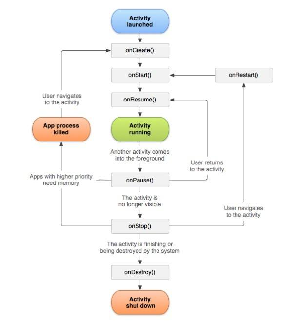

# 活动的生命周期

## 返回栈

> Android是使用任务（Task）来管理活动的，一个任务就是一组存放在栈里的活动的集合，这个栈也被称做返回栈（Back Stack）。

栈是一种后进先出的数据结构，在默认情况下，每当我们启动了一个新的活动，它会在返回栈中入栈，并处于栈顶的位置。每当我们按下Back键或调用finish()
方法去销毁一个活动时，处于栈顶的活动就会出栈，这时前一个入栈的活动就会重新处于栈顶的位置。系统总是会显示处于栈顶的活动给用户。

## 活动状态

> 每个活动在其生命周期中最多可能会有4种状态。

### 1、运行状态

> 当一个活动位于返回栈的栈顶时，这时活动就处于运行状态。

### 2、暂停状态

> 当一个活动不再处于栈顶的位置，但仍然可见时，这时活动就进入了暂停状态。

### 3、停止状态

> 当一个活动不再处于栈顶的位置，并且完全不可见的时候，就进入了停止状态。

### 4、销毁状态

> 当一个活动从返回栈中移除后就变成了销毁状态。

## 活动的生存期

> Activity类中定义了7个回调方法，覆盖了活动声明周期的每一个环节。

### onCreate()

> 它会在活动第一次被创建的时候调用。你应该在这个方法中完成活动的初始化操作，比如说加载布局、绑定事件等。

### onStart()

> 这个方法在活动由不可见变为可见的时候调用。

### onResume()

> 这个方法在活动准备好和用户进行交互的时候调用。此时的互动一定位于返回栈的栈顶，并且处于运行状态。

### onPause()

> 这个方法在系统准备去启动或者恢复另一个活动的时候调用。我们通常会在这个方法中将一些消耗CPU的资源释放掉，以及保存一些关键数据，但这个方法的执行速度一定要快，不然会影响到新的栈顶活动的使用。

### onStop()

> 这个方法在活动完全不可见的时候调用。他和onPause()方法的主要区别在于，如果启动的新活动是一个对话框式的活动，那么onPause()方法会执行，但是onStop()方法并不会执行。

### onDestroy()

> 这个方法在活动被销毁被销毁之前调用。之后活动的状态变为销毁状态。

### onRestart()

> 这个方法在活动由停止状态变为运行状态之前调用，也就是活动被重新启动了。

